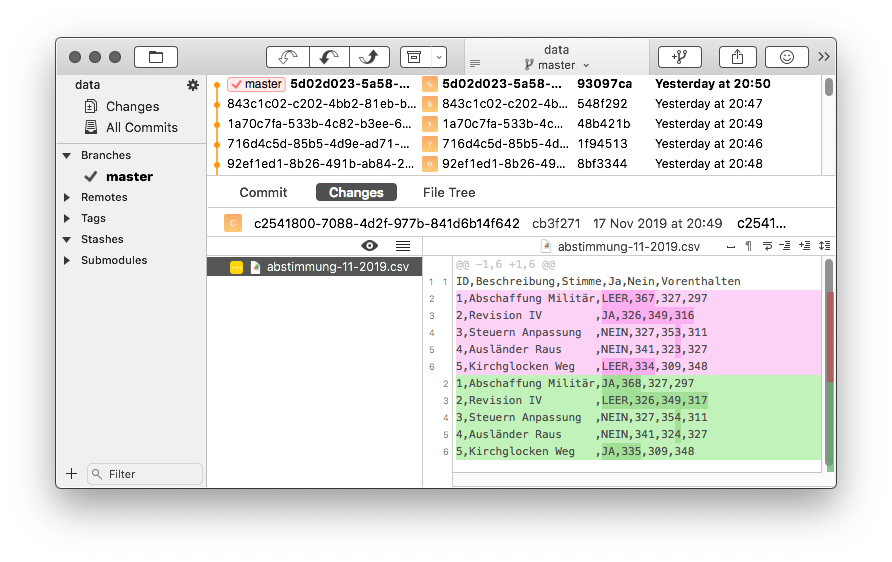

# E-Voting in Git

🔥Disclaimer: Don't take this repo seriously. Central e-voting technology only works if the current goverment and its IT people are trusted. Which is never the case, implementing this would only allow a corrupt goverment to be in charge forever.

The only way to have a trusted poll is: everyone brings his vote to the ballot, everyone is in the same room when they are counted (or participates in the counting).

## flow
1. people vote over central site
1. they get a receipt PDF
1. they validate their vote on thirdparty site

## Whys
* Why the UUID is secure and safe? RFC 4122 and DCE 1.1
* Why the vote result is delayed?
* Why Git is used? Google uses it, Merkle tree!
* Data is stored in CSV and not JSON? So more people can read it.
* How we protect against manipulation? We can't, unless every citizen can log into the cluster with SSH and check the binary, the processes, the filesystem.
